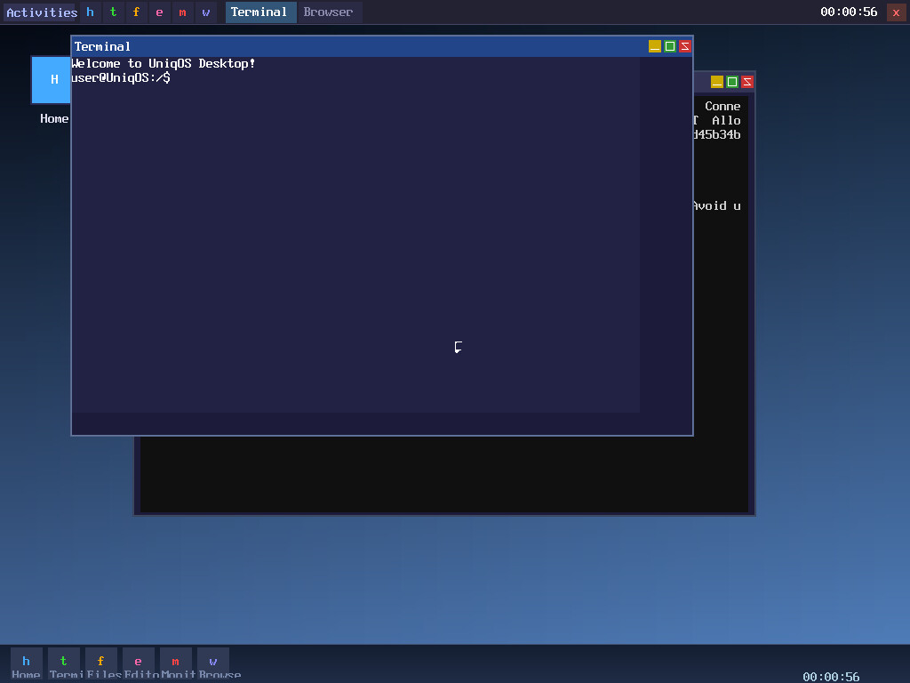
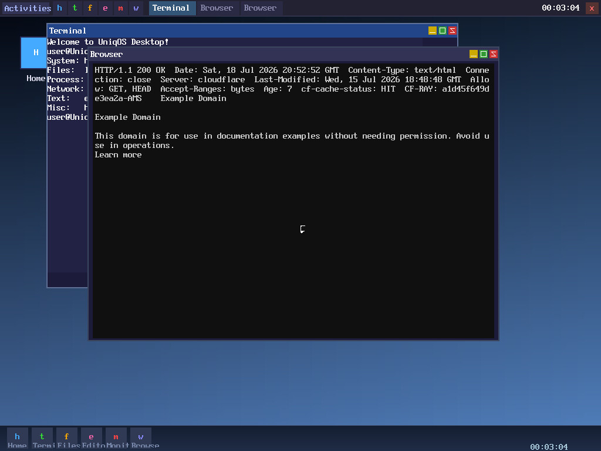
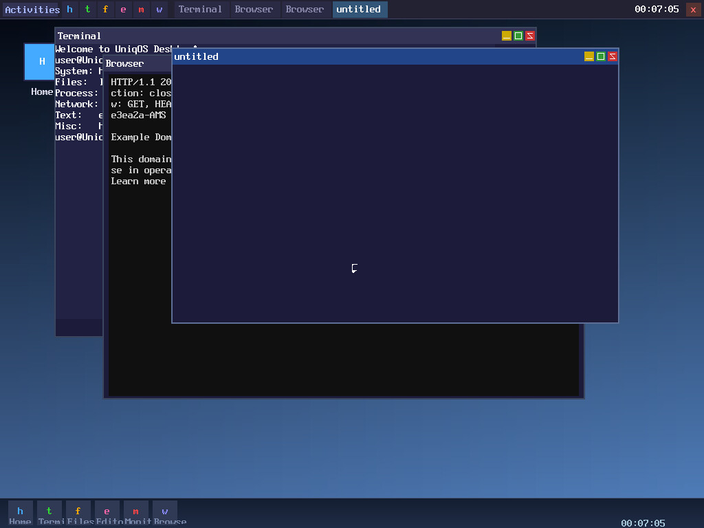
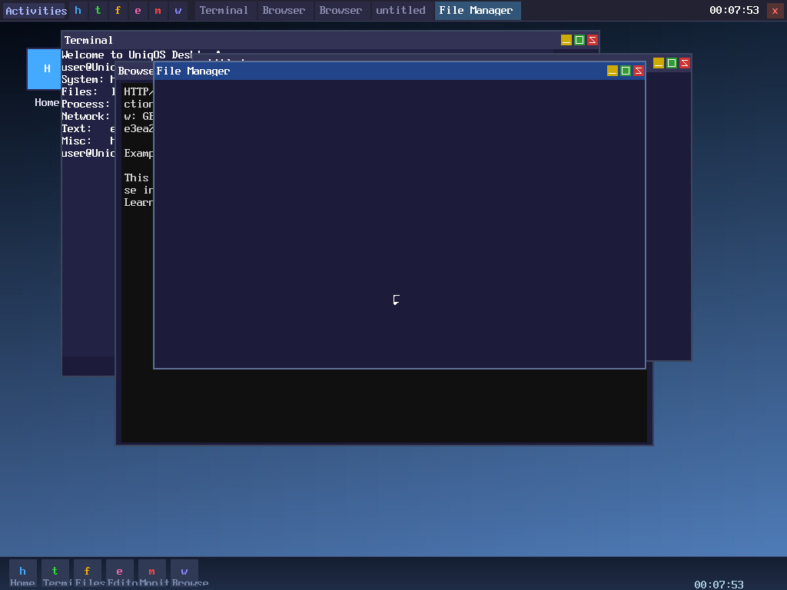
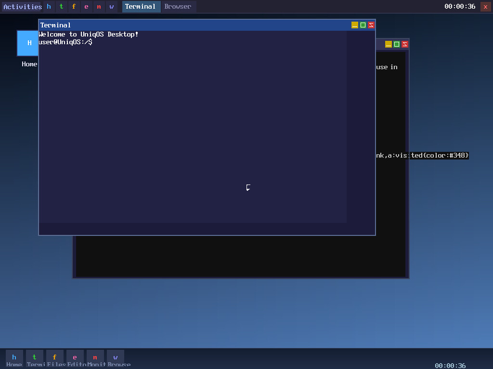

<p align="center">
  
</p>

<h1 align="center">UniqOS — A Custom Operating System Built by Humans + AI</h1>

<p align="center">
  <strong>Bare-metal x86_64 · GRUB/Multiboot2 · TCP/IP networking · GUI desktop · Working web browser</strong>
</p>

<p align="center">
  <em>Built from absolute zero — not a Linux distro, not a BSD fork. 100% custom kernel, drivers, network stack, and GUI.</em>
</p>

---

## Why Does This Exist?

**I knew this day would come. I just passively evolved a custom operating system.**

Not a Linux distro or spin-off. A totally custom OS. It runs. It has a GUI, TCP/IP capacity, and a working web browser. I used free tools. It cost me nothing — all the code was written with the help of LLMs.

This is a **hobby OS**, built in the open, as an inspiration to anyone who thinks building an operating system is out of reach. It's my personal milestone and a living artifact of how far AI-assisted development has come.

**Today — July 18, 2026 — it WORKS.** I can browse the web from a completely unique fingerprint, running in VirtualBox on a Linux host.

---

## The Bigger Picture: AI Progress Toward AGI

Every version of this OS is a **benchmark for AI capability**. The question isn't "can AI write code?" — it's "how autonomously can AI build complex systems?"

### The Real Shift: From "Write Code" to "Run Experiments"

```
2024: "Write me a browser" → generates broken code
2026: "Port NetSurf" → agent tries 50 approaches, returns working diff
2028: "Build me a browser engine" → agent designs architecture, writes spec, implements, verifies
```

The unit of work changes from **"lines of code"** to **"verified system behaviors."**

This project is part of that trajectory. Each AI-assisted capability added to UniqOS (TCP stack, browser parsing, styled rendering) represents a milestone in what AI can achieve when paired with human architecture and verification.

### What This Means

| Today | Near Future |
|---|---|
| You write kmalloc shim by hand | Agent writes shim, you review |
| You debug virtio_net via serial log | Agent captures pcap, correlates with kernel log, proposes fix |
| You design layout algorithm | Agent generates 10 variants, benchmarks in VM, picks fastest |
| You maintain Makefile | Agent generates build system from dependency graph |

**You become the architect/verifier. The agent becomes the experimental executor.**

---

## Screenshots

### Booting to Desktop
The OS boots from GRUB into a 1024×768 framebuffer with a fully functional GUI desktop environment including a bottom panel and window manager.
<p align="center">
  
</p>

### Original Tag-Stripped Browser
An early iteration of the browser — HTTP GET requests fetch web pages and display them with simple tag-stripping (no formatting).
<p align="center">
  
</p>

### Editor with Line Numbers
A code editor window with line numbers, blue focused area, white cursor, and typed text input — all rendered in the custom GUI.
<p align="center">
  
</p>

### File Manager
A graphical file manager that lists files in the VFS with colored titlebar and proper window management.
<p align="center">
  
</p>

### Styled Browser Pipeline (with terminal overlap)
The new styled-text browser pipeline running alongside the terminal. Blue link colors, grey rendered text, and proper DOM/CSS/layout processing — still behind the terminal window.
<p align="center">
  
</p>

---

## Known Issues

- **Terminal overlaps browser at boot** — the terminal window has focus after boot, so it renders on top of the browser. Close or minimize the terminal to see the browser content. This is a z-ordering UX issue, not a browser bug.
- **No scrollbar** — content that overflows the viewport is not accessible. The layout engine supports word-wrapping and pagination, but there is no scrollbar or viewport scrolling yet.
- **`<style>` tag content rendered as text** — the HTML parser includes the raw CSS text from `<style>` tags as visible content nodes. This should either be skipped or parsed into actual CSS rules.

## Next Steps

1. **Test with a richer page** — create a test page (e.g., `http://10.0.2.3/test.html`) with bold, italic, underline, multiple headings, paragraphs, images, and links to verify the full layout pipeline.
2. **Add scroll support** — implement viewport scrolling for content that exceeds the browser window height, with visual scrollbar indicators.
3. **Fix `<style>` tag handling** — either skip `<style>` content in the HTML parser or parse inline CSS rules and apply them to the style system.
4. **Network diagnostics** — capture pcap traces, run font grid tests, and add render tracing to confirm all subsystems are healthy before tackling more complex pages.

---

## Technical Architecture

UniqOS is a from-scratch x86_64 operating system with approximately **8,000 lines of source code** across C, assembly, and headers.

### Boot & Kernel
| Component | Description |
|---|---|
| **Boot** | GRUB/Multiboot2 → 64-bit long mode, boots via `boot.S`/`boot64.S` |
| **Memory** | Physical Memory Manager (PMM) + Virtual Memory Manager (VMM) with paging |
| **Heap** | Custom `kmalloc`/`kfree` allocator for kernel objects |
| **Interrupts** | IDT, PIC, PIT (100Hz timer), syscall gate |
| **Scheduler** | Cooperative multitasking with `thread_create`/`scheduler_yield` |

### Drivers
| Component | Description |
|---|---|
| **Display** | 1024×768 32-bit framebuffer via VESA/VBE (GRUB provides mode) |
| **Keyboard** | PS/2 scancode handling with keyboard mouse mode (Ctrl+M) |
| **Mouse** | Absolute positioning via VirtualBox extension-less mouse mode |
| **NIC** | `virtio_net` — paravirtualized network adapter, interrupt-driven |
| **PCI** | PCI bus enumeration for device discovery |

### Network Stack (Full TCP/IP)
| Component | Description |
|---|---|
| **Ethernet** | Raw frame TX/RX via virtio |
| **ARP** | Address Resolution Protocol — resolves IP→MAC, caches entries |
| **IP** | Internet Protocol — packet routing, checksums |
| **ICMP** | Ping support (echo request/reply) |
| **TCP** | Full state machine — SYN/SYN-ACK/ACK, `tcp_send`/`tcp_close`, sequence tracking |
| **DNS** | UDP-based DNS resolution with callback |
| **HTTP** | HTTP 1.0 GET requests, chunked header parsing, fetch callback |

### GUI & Windowing
| Component | Description |
|---|---|
| **Window Manager** | z-ordered windows with titlebars, close/minimize buttons |
| **Font Renderer** | PSF font with styled output (`display_put_char_styled`) — bold synthesis, italic slant, underline |
| **Desktop** | Bottom panel with app launch buttons, task switching |

### Applications
| App | Description |
|---|---|
| **Browser** | HTML parser → CSS style mapping → Flow layout engine → Styled renderer → Clickable link map. Fetches via HTTP/1.0. |
| **Terminal** | Framebuffer terminal emulator with command shell |
| **Editor** | Multi-line text editor with line numbers |
| **File Manager** | Directory listing with VFS backend |
| **SysMon** | Live system monitor (memory, uptime) |

---

## Building and Running

### Prerequisites
- `clang-21` (LLVM/Clang cross-compiler targeting x86_64-none-elf)
- `ld.bfd` (GNU ld)
- `xorriso` (for ISO creation)
- `VirtualBox` or `QEMU` (for running)

### Build
```bash
cd x86_64
make iso      # Build optimized release ISO
make debug    # Build with debug symbols (Og -g)
```

### Run (VirtualBox)
```bash
make run-vbox   # Builds ISO and starts "UniqOS" VM
```

Or manually:
1. Create a VM named "UniqOS" with:
   - Type: Other, Version: Other/Unknown (64-bit)
   - Memory: 512MB+
   - Network: NAT
   - Storage: Attach `uniqos.iso`

### Run (QEMU)
```bash
make run-qemu   # Builds and runs with serial output
```

### Controls
| Key | Action |
|---|---|
| `Ctrl+Shift` | Toggle keyboard mouse mode |
| `h`/`j`/`k`/`l` | Move mouse left/down/up/right (in mouse mode) |
| `Space`/`Enter` | Left click (in mouse mode) |
| `Ctrl+T` | New terminal |
| `Ctrl+E` | Open editor |
| `Ctrl+B` | Open browser |
| `Ctrl+F` | Open file manager |
| `Ctrl+M` | Open system monitor |

---

## AI Frameworks That Inspired This Project

This project was built with assistance from frontier LLMs. The following multi-agent frameworks represent the trajectory of AI capability that makes projects like this possible:

| Framework | Stars | Type | Best For |
|---|---|---|---|
| AutoGPT | 185K | Autonomous agent loop | Single agent with tools |
| AutoGen (Microsoft) | 60K | Multi-agent conversation | Agent teams, code generation |
| crewAI | ~20K | Role-based crews | Structured workflows |
| CAMEL | 17K | Multi-agent framework | Research, scaling laws |
| ChatDev | 34K | Virtual software company | Simulated dev teams |
| AgentVerse | 5K | Multi-agent deployment | Applications |
| Langroid | 4K | Multi-agent programming | Dev-focused |
| Generative Agents | 22K | Simulated society | Social simulation |

The trajectory is clear: each generation of these frameworks reduces the gap between human intent and working software. UniqOS is a data point on that curve.

---

## File Map

```
UniqOS/
├── assets/               # Screenshots and logo for README
├── qa_shots/             # Full-resolution screenshots
├── x86_64/
│   ├── boot.S / boot64.S # Bootloader entry (GRUB → long mode)
│   ├── kernel.c          # Main kernel entry point
│   ├── kernel.h          # Kernel API and platform defines
│   ├── Makefile          # Build system (clang-21 cross-compiler)
│   ├── link.ld           # Linker script
│   ├── grub.cfg          # GRUB boot config (1024x768 framebuffer)
│   ├── multiboot2.h      # Multiboot2 structures
│   ├── gdt.c / idt.c     # GDT/IDT setup for protected/long mode
│   ├── pic.c / pit.c     # Interrupt controller and timer
│   ├── pmm.c / vmm.c     # Physical & virtual memory managers
│   ├── heap.c            # Kernel heap allocator
│   ├── scheduler.c       # Cooperative thread scheduler
│   ├── display.c         # Framebuffer drawing primitives
│   ├── font.c            # PSF font renderer (8x16 bitmap)
│   ├── keyboard.c        # PS/2 keyboard driver
│   ├── mouse.c           # PS/2 mouse driver (absolute positioning)
│   ├── pci.c             # PCI bus enumeration
│   ├── virtio_net.c      # VirtIO network adapter driver
│   ├── net.c / arp.c     # Ethernet + ARP layer
│   ├── ip.c / icmp.c     # IP + ICMP (ping) layer
│   ├── tcp.c             # TCP state machine (SYN/SYN-ACK/ACK/DATA/FIN)
│   ├── dns.c             # DNS resolver (UDP, callback-based)
│   ├── http.c            # HTTP 1.0 GET client
│   ├── html_parse.c      # Recursive-descent HTML DOM parser
│   ├── css_minimal.c     # Tag→CSS style mapping (bold, italic, block, etc.)
│   ├── layout.c          # Flow layout engine (word-wrap, margin, block)
│   ├── render.c          # Box renderer (styled text, images, links)
│   ├── link_map.c        # Clickable link rectangle builder
│   ├── browser.c         # Web browser app (history, links, navigation)
│   ├── desktop.c         # GUI desktop (window manager, taskbar)
│   ├── window.c          # Window abstraction (z-order, draw, click)
│   ├── fbterm.c          # Framebuffer terminal emulator
│   ├── shell.c           # Command-line shell
│   ├── editor.c          # Text editor app
│   ├── fileman.c         # File manager app
│   ├── sysmon.c          # System monitor app
│   ├── vfs.c             # Virtual filesystem
│   └── support.c         # String/memory utilities
├── OPENCODE_BROWSER_PROMPT.md  # Full styled-browser spec
└── README.md
```

---

## How This Started

A personal challenge: **can an individual with AI assistance build a complete operating system from scratch?**

The answer, as of July 2026, is **yes**.

Not just a booting kernel — a system with:
- Graphics and windowing
- Full TCP/IP networking (stateful TCP, DNS, ARP, ICMP)
- A web browser that renders styled HTML pages
- Multiple concurrent applications (terminal, editor, file manager, system monitor)
- Mouse and keyboard input

The browser can load real websites from the internet, parse their HTML, apply CSS-like styling, lay out the content with word wrapping, render bold/underlined/colored text, and handle clickable links for navigation.

This is a **completely unique browser fingerprint** — no Chrome, no Firefox, no WebKit. Just raw HTTP over a custom TCP stack displayed through a custom font renderer.

---

## License

This project is shared as a learning resource and inspiration. Feel free to study, fork, and experiment.

---

<p align="center">
  <strong>Built in the open. For the curious. For the future.</strong><br>
  <em>"The best way to predict the future is to build it."</em>
</p>
